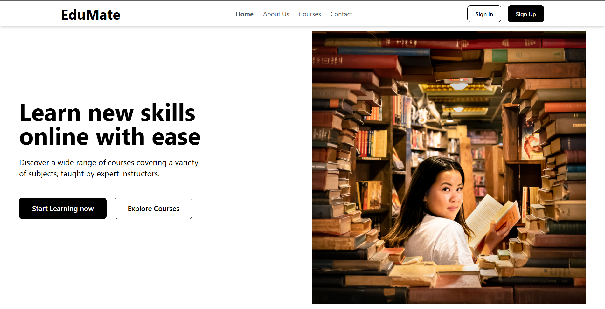
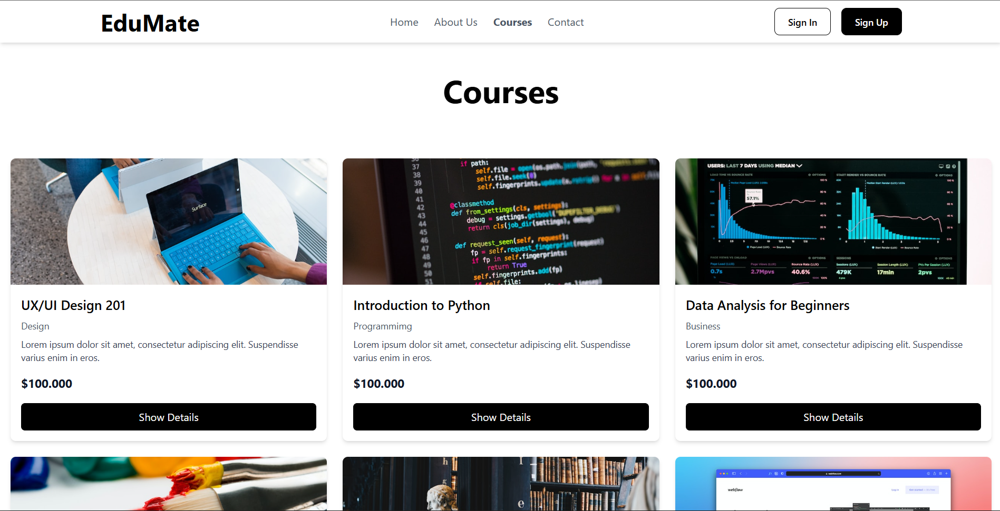
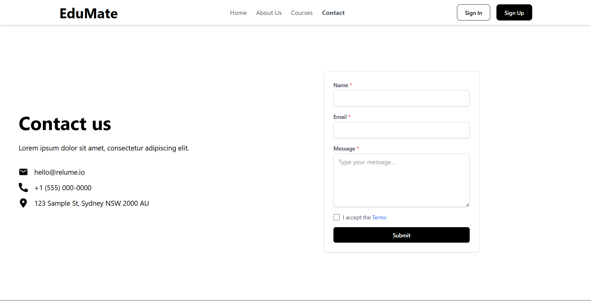
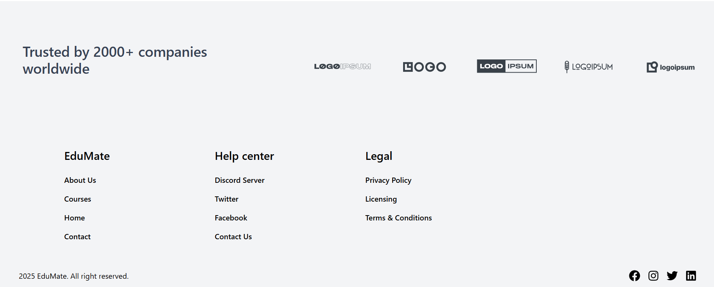

# Django + React Learning Project

This project was built as a way for me to learn how to connect **React** with **Django** while also practicing **Tailwind CSS** for styling.  
It was developed in the past year and mainly focuses on authentication and basic pages integration.

---

## 🚀 Features
- **Authentication**: Sign in and Sign up pages.
- **Main Pages**:
  - Home page
  - About Us page
  - Courses page (⚠️ only displays courses; no learning/watching workflow implemented)
  - Contact Us page
- **Styling**: Tailwind CSS for a modern and responsive UI.

---

## 📸 Screenshots
Here are some previews of the application:

*Home Page*

*Courses Page*

*Contact Us Page*

*Footer*

---

## ⚙️ Tech Stack
- **Backend**: Django 
- **Frontend**: React 
- **Styling**: Tailwind CSS

---

## 📌 Notes
- The **Courses page** is static and only displays available courses(fetch from DB); it does not include a video player or learning workflow.
- This project is primarily for **educational purposes**.

---

